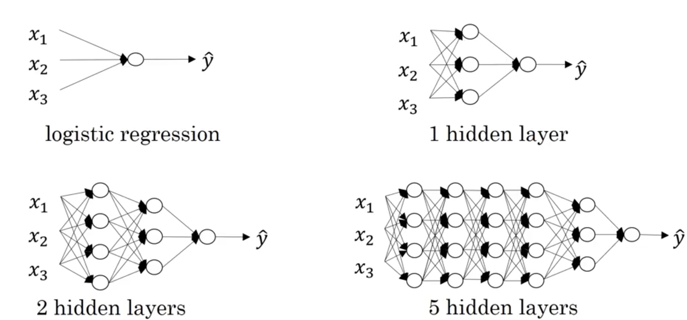
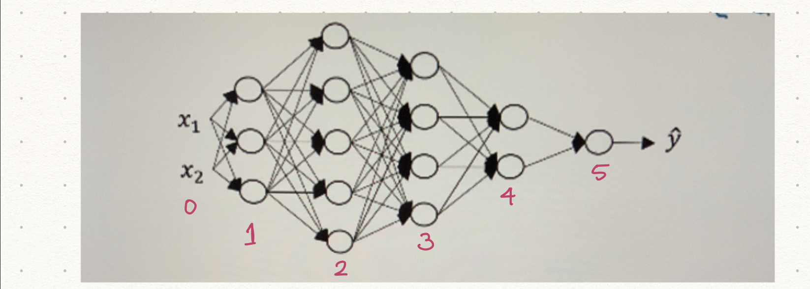

[TOC]


# Week 4: Deep Neural Network

In this week we will understand the key computations underlying deep learning, use them to build and train deep neural networks, and apply them to computer vision. 

The learning objectives for this week are: 

-   Describe the successive block structure of a deep neural network
-   Build a deep L-layer neural network
-   Analyze matrix and vector dimensions to check neural network implementations
-   Use a cache to pass information from forward to back propagation
-   Explain the role of hyperparameters in deep learning


## Deep Neural Network

So far we have seen shallow neural network and a neural network with two hidden layers. However, neural networks can have multiple hidden layers. Here are examples, of neural networks: 



We have seen the top neural networks. Note that we do not count the input layer in the total number of layers. Therefore, the top left is a 1-layer NN. The top right is a 2-layer NN while the bottom ones are 3-layer and 6-layer neural networks. We will use the uppercase $L$ to denote the number of layers in a given NN, while we will use $n^{[l]}$ to denote the number of units in the $l$th layer. 

For example, if we look at the NN with 5 hidden layer, we would say, $L=6$ and $n^{[2]} = 4$, $n^{[5]} = 3$ while $n^{[6]} = 1$. We will denote $n^{[0]}$ to be the nodes corresponding to the input layer. So, $n^{[0]}= 3$ in our example. 

Finally, we have already defined the activation: $a^{[0]}= X$, i.e., the input feature vector. We define $a^{[L]} = \hat{y}$ to be the output prediction vector.   

## Forward Propagation in Deep Network

Let's see what a forward propagation looks like in a deep neural network. As we have seen, in the forward propagation, we do two computations: 

*   Compute the weighted sum of the activations for the previous layer and the bias. We call this $Z$
*   Compute the activation of $Z$. 

So, the general rule for computing forward propagation for a single instance at a given layer $l$ is:
$$
z^{[l]} = w^{[l]}a^{[l-1]} + b^{[l]} \\[15pt]
a^{[l]} = g^{[l]}(z^{[l]})
$$
For the whole training set, for a given layer, we would have: 
$$
Z^{[l]} = W^{[l]}A^{[l-1]} + B^{[l]} \\[15pt]
A^{[l]} = g^{[l]}(Z^{[l]})
$$
where each of the upper case letters are matrices. 

>   Unfortunately, when computing the equation 2 for each of the layer through forward propagation, we will need to use a for loop. 

For example, if we have a 4-layer NN, we will need to use a loop that goes from $l=0, 4$. So, it would be something along the lines: 

```python
A[0] = X
for l in range(1, 4):
    Z[l] = W[l]A[l-1] + B[l]
    A[l] = g[l](Z[l])
```

## Getting your Matrix Dimensions Right

To ensure that your code runs well, it is important that the dimensions of each of the matrices are correct. We will take an example here to show how we can check the dimensions of the matrices and more importantly, we will create a formula for the dimensions of all of the matrices. 

Consider the following 5-layer deep NN: 



### Single Instance

We can write the equations for forward propagation as follows: 


Here we wrote it the first two layers. Let's go through each of the dimensions. 

*   The first is the computation of $Z^{[1]}$. We start with our input feature vector, $a^{[0]}$. It has dimensions of $(2, 1)$. The weights matrix should have weight associated with the features. As there are two features, we have 2 weights. However, the weights will be different for different units in the layer. As there are 3 layers, we would have 3 rows of 2 weights. Thus, $w^{[2]} = (3, 2)$. 
*   Finally, the bias term. Each unit will have a bias associated with it. So, the bias dimensions would be $b^{[1]} = (3,1)$. 
*   The $a^{[1]} = g^{[1]}(z^{[1]})$, so it will always have the same dimensions as z.

Next, let's look at the dimensions of the second layer. 

*   We know that $a^{[1]} = (3, 1)$. So, we have three weights associated with each $a$. Now this layer has 5 units, so the dimension of $w^{[2]} = (5, 3)$. And so, the dimensions of $z^{[2]} = (5, 1)$. 
*   The bias would have the dimensions of units in the given layer, so $b^{[2]} = (5, 1)$. 
*   Finally, $a^{[2]} = (5, 1)$ as $z^{[2]} = (5, 1)$.

We begin to see a relationship here. So, let's generalize. For a given layer $l$ and single instance, we would have the following dimensions: 
$$
a^{[0]} = (x, 1) \\[15pt]
w^{[l]} = (n^{[l]}, n^{[l-1]}) \\[15pt]
z^{[l]} = (n^{[l]}, 1) \\[15pt]
b^{[l]} = (n^{[l]}, 1) \\[15pt]
a^{[l-1]} = (n^{[l]}, 1)
$$


The dimensions of `dw` and `db` should be the same as $w$ and $b$. 

### $m$ instances

When we have $m$ instances, the dimensions of $W$ and $B$ will remain the same. But the dimensions of $Z$ and $A$ will change: 
$$
A^{[0]} = (n^{[0]}, m) \\[15pt]
Z^{[l]} = (n^{[l]}, m) \\[15pt]
A^{[l]} = (n^{[l]}, m)
$$

## Why Deep NN do better than Shallow NN? 

Deep NN works better than shallow NN because it has to do with the number of layers. Each layer learns a little bit about the data. However, overall the combination of layers learns a lot more about the data. Typically, the learning is hirarchical. For example, consider an image. The first layer will learn to identify the boundaries of the image. The second layer will identify a little more complex part of the image, such part of a mouth, or an eye. As we go into higher number of layers, the complexity of what is being looked at increased. Towards the end of a deep neural network, a layer may look at an image as a whole or identify the bounding box of a person in the photo. 

In short, NN learn progressively and so if NN is deep, it has that many layers to get to the complexity of the data. While the shallow network never reaches that complexity. 

## Building Blocks of Deep Neural Networks

