[TOC]


# Course 1: Neural Network & Deep Learning

Deep learning, just like machine learning, has transformed the world as we know it. Deep learning has become very important to the companies and has become a sought after skill. 

## Week 1: Introduction to Deep Learning

There are a total of five courses in this specialization. The five courses are the following: 

*   **Neural Networks & Deep Learning**: In this course we will learn about the neural networks, how to build a deep neural network, and how to train it on data. 
*   **Improving Deep Neural Networks: Hyperparameter tuning, Regularization & Optimization**: In this course we will learn about the tools to fine tune the networks. We will learn tools such as regularization, hypertuing, and and advanced optimization algorithms. 
*   **Structuring your Machine Learning Project**: In this course, we will learn how to structure our ML project. We will learn best practices and learn about end-to-end DL. 
*   **Convolutional Neural Network**: In this course we will talk about CNN. These models are often applied to images. 
*   **Natural Language Processing: Building sequence models**: In this course we will learn models that learn overtime. We will apply these models to sequence data and speech recognition and music generation. 

### What is a Neural Network? 

The term **deep learning** refers to training Neural Networks, sometimes very large neural networks. So, what is a neural network? To understand this, consider an example of predicting housing prices. In the figure below, we have just one variable, `size`. This is the size of a house and the output variable is `price`. So, based on the size of the house, we predict its price.


We have few observations marked in purple. We fit a model to the data. For given size, there are no houses and so the price for smaller sizes is zero. It has a non-zero value after a certain point and zero value before that point for a given size. This is an example of very simple neural network. A neural network for this example is drawn as follows: 

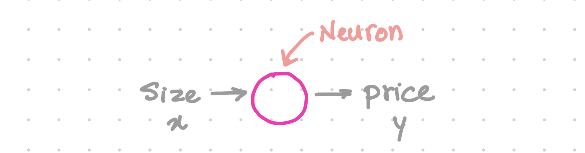

This neural network takes a single input and predicts an output. The neuron in neural network is represented by the circle. The model that was fit on the data in the above figure is called the **Rectified Linear Unit** or ReLU. The ReLU function is zero for some values and then increases linearly. 

Once we have a single neuron, we can easily stack them into multiple neurons and create a model that is more complex. For example, in the housing example above, rather than just the size, we include more features such as  `# of bedrooms`,  `zipcode`,  `family size`,  `walkability`,  `wealth`, `school quality`. The neural network in this case would look something like this: 


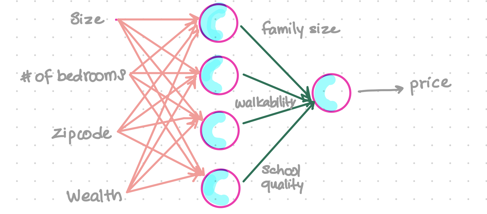

This neural network is quite complex. It is to be noted that input features are the one of the left hand side of the image. The features in between such as `family size` etc...is automatically decided by the neural network. 

We note that each neuron is connected with each other. There are 4 input features on the left. This is known as the **input layer**.  The second neuron is called the **output layer**, which is followed by the output variable, `price`. 

>   The first neurons are called **hidden units** because they are not visible to us. All we have are the inputs and the outputs. 

>   When each neuron is connected with each other, we say that the neural network is said to be **densely connected**. 

The neural network decides which features it wants to take in the middle as long as we give it the features in the input layer. This is the hallmark of neural networks. 

### Supervised Learning with Neural Networks

Supervised learning consists of features and associated labels. In machine learning, we use both the input features and the output label to train the model. This is why we call this type of learning supervised learning. Below is a table containing some examples of supervised learning and associated type of neural networks that are typically used for those type of problems. 

| Input         | Output            | Application         | Type of Neural Network       |
| ------------- | ----------------- | ------------------- | ---------------------------- |
| Home Features | Price             | Real Estate         | Standard Neural Network      |
| Ad, User Info | CTR               | Online Advertising  | Standard Neural Network      |
| Image         | Object            | Photo Tagging       | Convolutional Neural Network |
| Audio         | Text Transmission | Speech Recognition  | Recurrent Neural Network     |
| English       | French            | Machine Translation | Recurrent Neural Network     |
| Image, Radar  | Car Positions     | Autonomous Driving  | Hybrid Neural Network        |

We will learn these types of neural networks in this course. The neural networks are represented pictorally as, 

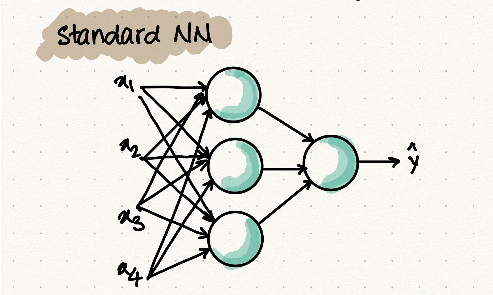

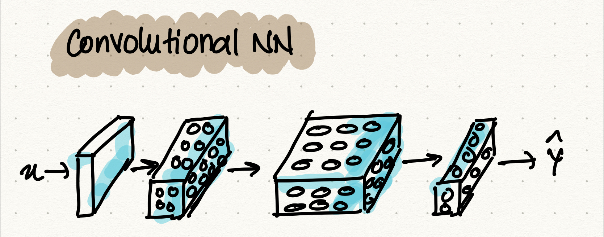

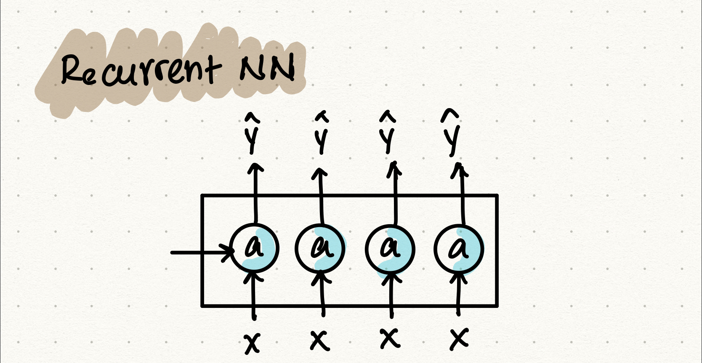

Machine learning applications work both for **structured data** and **unstructured data**. The examples of structured data include tables, spreadsheets while audio files or individual words are examples of unstructured data. It has been harder for machines to work with unstructured data. However, thanks to neural networks, working with unstructured data is much more possible. We will learn to apply neural networks to both structured and unstructured data.

### Why is Deep Learning Taking off? 

Deep learning has been around since the 1970s. However, it has been taking off now because of the following figure: 

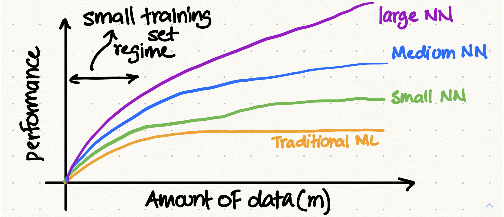

The figure shows the amount of labeled data in the x-axis and the performance of the model in the y-axis. For traditional ML algorithms, increasing the data does increase the performance in the beginning. However after some amount of data, the performance plateaus. On the other hand, for neural networks, the increase in data continues to increase their performance. Of course, the performance also depends on the complexity of the neural network. The only caveat is that the larger the neural network, the better it does with lots of data but longer it may take to train it. 

In the small training set regime, the traditional ML may be equally good as the neural network. The biggest breakthrough in the domain of AI has been the move from the **sigmoid function** to the **Rectificed Linear Unit (ReLU) function**.

 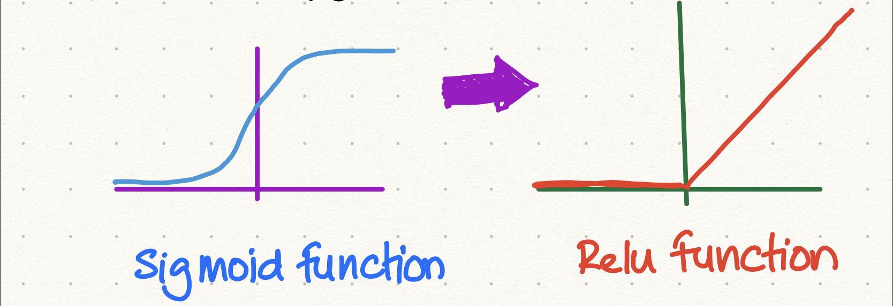

The ReLU is better suited than the sigmoid function because at the extremities the gradient descent takes a very long time to converge. The shape of the sigmoid function makes it hard. Because of this, the GD algorithm takes a lot of steps to converge. However, in the case of ReLU this does not happen. The ReLU function is also called the **activation function** for the neural network.

>   Why do we need an activation function? An activation function decides, whether a neuron should be activated or not by calculating weighted sum of the bias of it. The purpose of the activation function is to introduce non-linearlity into the output of a neuron.
>
>   The non-linearity is essential in a neural network because without it, a neural network would simply be a linear regression model. 

The other advantage of using neural networks is the iterative process through which they go in order to improve their performance. This is illustrated in the figure below: 

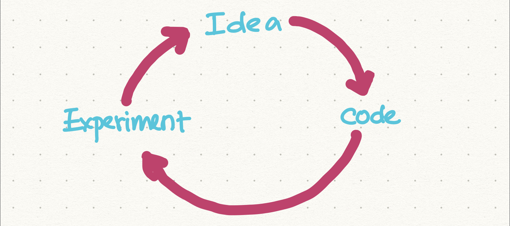

Faster computation has really helped the researchers to iterate through the loop quickly and implement ideas. 

## Week 2: Neural Network Basics

In this week, we will learn to set up a machine learning problem with a neural network mindset. We will also learn to use vectorization to speed up our models. 

The key concepts that are covered in this week are: 

*   Build a logistic regression model, structured as a shallow neural network
*   Implement the main steps of an ML algorithm, including making predictions, derivative computation, and gradient descent
*   Implement computationally efficient, highly vectorized version of the models
*   Understand how to compute derivatives for logistic regression using a backpropagation mindset
*   Be able to implement vectorization across multiple training examples 

### Notation Used

This section describes the notations used for the entire course.

*   $x$: represents a single training example,  $x \in \R^{n_x}$. In other words, the sample $x$ is a single sample that consists of $n_x$ features. 
*   $y$: is the output label. 
*   $(x, y)$: is a single training example. 
*   $X \in \R^{n_x \times m}$: is the input matrix which has $n_x$ features and $m$ samples. This is a $(n_x,m)$ matrix. 
*   $x^{(i)} \in \R^{n_x}$ : is the $i$th example represented as a column vector, $(n_x, 1)$. 
*   $Y \in \R^{n_y \times m}$ is the label matrix which has $n_y$ labels and $m$ samples. This is a $(m, 1)$ matrix
*   $y^{(i)} \in \R^{n_y}$: is the output label for the $i$th example and represented by a single value
*   The superscript $(i)$ will denote the $i$th training example while the superscript $[l]$ will denote the $l$th **training layer**. 
*   $m$: are the number of examples in the dataset
*   $n_x$: the input size, also known as the features
*   $n_y$: the output size (or the number of classes)
*   $n_h^{[l]}$: the number of hidden units of the $l$th layer
*   $L$: the number of layers in the network

### Logistic Regression as a Neural Network

In neural networks, the training set is processed directly without looping through each of the examples. In particular this is also done without the use of `for` loops. Another imporant thing to note about NN is that there are two processes that happen. There is a forward pass from the input to the output which is called the **forward propagation** and then there is a backward pass which is called the **backpropagation**. We will implement this for logisitc regression. 

The logistic regression is a machine learning algorithm that is used for binary classification problems. For example, if we wish to create a model that recognizes cats in the photo. The output of the model should result in two categories: "cats" and "no cats".  Think of the following figure. We give the NN an image and the NN will output either a `0` or a `1`. 

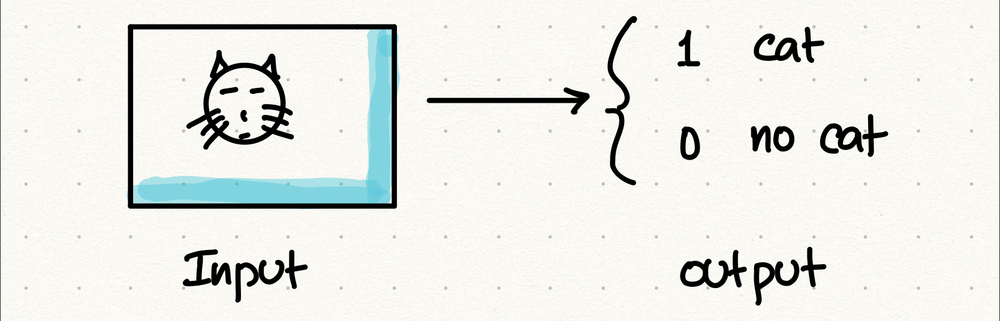

Now the image itself is composed of three color filteres, red, blue, and green. Suppose the image is $64 \times 64$ pixels. So, then we will have three images in the three colors or pixel intensities. 

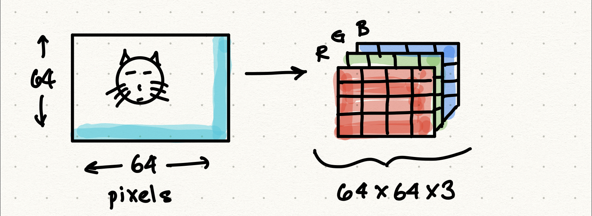

Now, the image by itself is a single example. We can convert all the pixel colors, which there are $64 \times 64 \times 3 = 12, 288$  of them into a single column vector. This would be our single sample. In other words, we concatenate all the pixel intensities. So, what we have done is to represent a picture by a single vector called the **feature vector** because it has 12,288 features. We represent the dimensions of the features by $n_x = 12288$. Thus, there are 12, 288 features. 

In binary classfication problem, we take the image and convert that into a feature vector $X$ and predict its corresponding label, $y$, which is either `0` or `1`.  

*   For the logistic regression, a $(x, y)$  represents a single training example with $x \in \R^{n_x}$ and $y \in \{0,1\}$, the corresponding label. 

*   The training set will comprise of $m$ training examples: $[(x^{(1)}, y^{(1)}), (x^{(2)}, y^{(2)}),..., (x^{(m)}, y^{(m)})]$
    Note that each $x^{(i)}$ is a feature vector with 12, 288 features. 

*   The lowercase $m$ are the number of training examples. 

*   All the training examples and the features can be concisely represented as follow:
    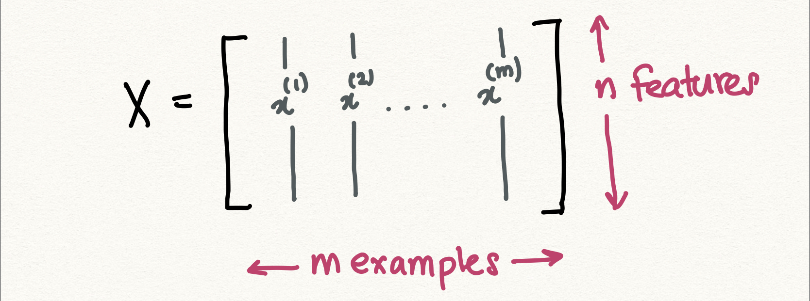

    So, our matrix, $\bold{X} \in \R^{n_x \times m}$ dimensional matrix. This is slightly different from the traditional machine learning scenario where $\bold{X} = \bold{X}^T$. 

    >   The rows are the features while the columns are the training examples. 

*   The notation for the labels will be used in the following way: 

    

    In this case, $\bold{Y} \in \R^{1 \times m}$. 

Returning to Logistic regression, the problem is as follows: 

We are given a sample vector $x^{(i)}$ and we want to predict its corresponding label $\hat{y}$ such that $\hat{y} = P(y = 1|x)$. Note that the label $y$ or its predicted value $\hat{y}$ are bound between 0 and 1. We make use of the parameters $w \in \R^{n_x}, b \in \R$. As we might do in linear regression, we can express the output as a linear combination of the weights $w$ and the constant $b$:
$$
\hat{y} = w^Tx + b
$$
However, given the nature of linear regression, the output values are going to be real numbers. Instead we wish to limit our outputs to between 0 and 1. This is where the **sigmoid function** comes in. 

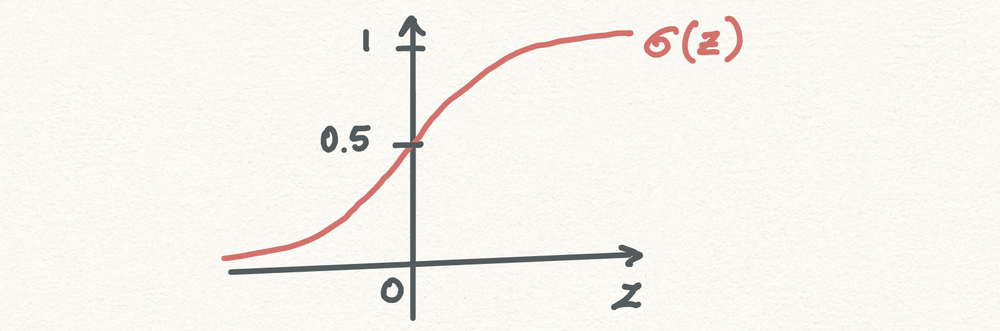

The sigmoid function is given by the following equation: 
$$
\sigma(z) = \frac{1}{1 + e^{-z}}
$$
We can easily verify that this function is bound between `0` and `1`. With this in mind, we write the output as, 
$$
\hat{y} = \sigma(z) = \sigma(w^Tx + b)
$$
At times it is convenient to absorb the constant, $b$ into the weights by setting $w_0 = b$ and $x_0=1$. By doing so, the above equation then becomes: 
$$
\hat{y} = \sigma(w^Tx)
$$
where $w = [w_0, w_1, ..., w_{n_x}]$ with $w_0 = b$. This is what is typically done in ML.

>    **we will choose to keep $w$ and $b$ separate.** 

As seen from the above equation, Eq. 4, the logistic regression boils down to determining the parameters $w$ and $b$ such that the predictions $\hat{y}$ are as close to the actual labels, $y$. The determination of how close the predictions are to the actual labels is done by the use of **loss function**. 

We could use the RSS as the loss function as we do in linear regression. But this is generally not used because using this in the logisitic regression causes the loss function to be non-convex. A non-convex function is generally hard for GD algorithm to work well. 

The loss function for logistic regression that we use is given by, 
$$
\mathcal{L}(\hat{y}, y) = -[y\ log (\hat{y}) + (1-y)\ log(1-\hat{y})]
$$
We can see that this loss function penalizes the predictions that are not close to the actual label. For example, when $y=1$, the second term is zero. The loss function will be small when $\hat{y}$ approaches $1$ else, it will be large. Similarly, when $y=0$, then the first term is zero and the second term is simply $-log(1-\hat{y})$. Again, the loss function is small when $\hat{y}$ approaches 0 else it will be large. 

The loss function is generally defined for a single sample. The **cost function** is defined as the average or the sum of the loss function across all samples. The cost function for logistic regression is defined as, 
$$
\mathcal{J}(w,b) = \frac{1}{m}\sum_{i=1}^m\mathcal{L}(\hat{y}, y) = -\frac{1}{m}\sum_{i=1}^m(y^{(i)}\ log \hat{y}^{(i)} + (1-y^{(i)})\ log(1-\hat{y}^{(i)}))
$$

Note that $\hat{y} = f(w, b)$, therefore $\mathcal{J} = f(w, b)$. 

### Gradient Descent

The gradient descent allows us to find optimal model parameters such that the cost function is the lowest. Let's see how we can apply the gradient descent algorithm to logistic regression. 

 To illustrate the gradient descent algorithm, consider a one-dimensional case, 


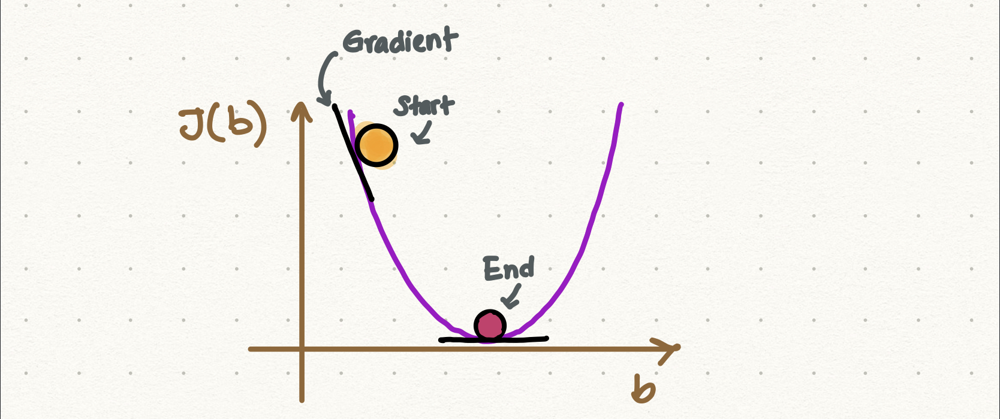

The curve is the loss function. We see that the curve is smooth and has just one minimum value. Such a curve is called a **convex function**. When a curve has more than one minimum, often called local minima, the curve is **non-convex**. 

The gradient descent for the convex function can start anywhere. The gradient descent of the cost function at a particular point is the slope at that point.  The gradient descent equation is given by, 
$$
w_{update} = w_{old} - \alpha\frac{\partial\mathcal{J}}{\partial w} \\[15pt]
b_{update} = b_{old} - \alpha\frac{\partial\mathcal{J}}{\partial b}
$$
>   This is a vectorized form. So, all the features are updated at the same time when we go through each iteration. The above is run multiple times until convergence. 

 Let's consider the simple case, 1D and see what happens. Consider the figure below: 

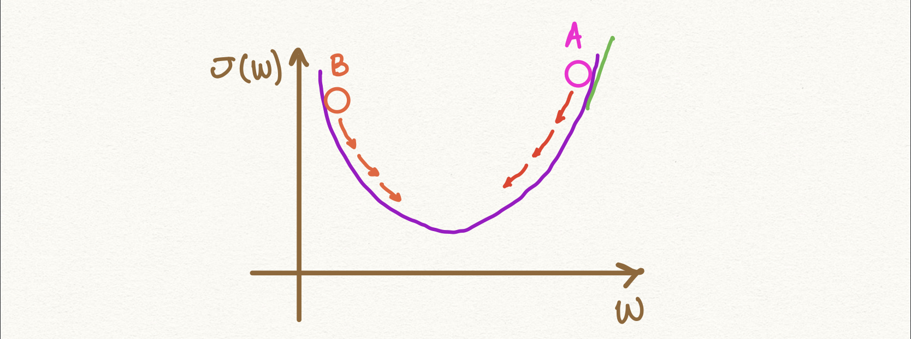

In this case, we have just one dimension, so our above equation, Equation 7 becomes: 
$$
w_{update} = w_{old} - \alpha\frac{d\mathcal{J}}{dw}
$$
In the case of A., the derivative, the slope at point A, is positive so the updated $w$ will decrease and move towards the minimum value. On the other hand, for B, the slope is negative so the above equation will increase updated $w$ and move it towards the minimum value.

The $\alpha$ is called the **learning rate**. It is the step that is taken each time in moving towards the minimum value. The learning rate is optimized through training. 

In general, the cost function is not 1D but multi-dimensional so we take the partial derivative of the cost function based on parameters. 

>   In this course we wll use $\partial/\partial w$ will be written as $dw$ in the code.  

### Computation Graph

Deep learning involves the use of forward propogation and backward propogation. The computation graphs aid us in visualizing these two movements in deep learning. To illustrate this point, consider a function, 
$$
J(a, b, c) = 3(a + bc)
$$
We can break the calculation of $J$ as,

 $u = bc; \\ v = a + u;\\ J = 3v$ 

We can illustrate this calculation as follows: 

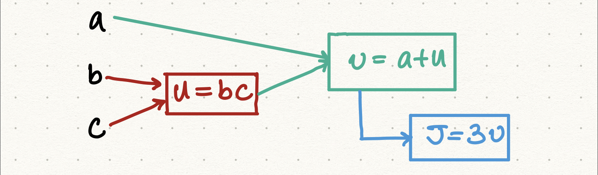

The computation graph comes in handy when you wish to optimize an output variable such as $J$ in the case. In the case of logistic regression $J$ is the cost function that we are trying to minimize. 

What we see here is that from left-to-right pass, we compute the value of $J$ and as we will see in the next few steps, the right-to-left pass, we compute the derivatives. 

The backward propogation is starting from the right and going left which involves the use of derivatives. 

Let's look at various derivatives: 
$$
\frac{\partial J}{\partial v} = 3 \\[10pt]
\frac{\partial J}{\partial a} = \frac{\partial J}{\partial v}\frac{\partial v}{\partial a} = 3 \cdot1 = 3 \\[10pt]
\frac{\partial J}{\partial b} = \frac{\partial J }{\partial v }\frac{\partial v}{\partial u}\frac{\partial u}{\partial b} = 3\cdot 1\cdot c = 3c \\[10pt]
\frac{\partial J}{\partial c} = \frac{\partial J}{\partial v}\frac{\partial v}{\partial u}\frac{\partial u}{\partial c} = 3\cdot 1 \cdot b = 3b
$$

>   The backpropogation consists of taking the derivative going back, e.g., taking the derivative of $J$ w.r.t. $v$ results in doing a backpropogation of 1 step. Taking a derivative of $J$ w.r.t. $u$ corresponds to doing a backpropogation of 2 steps and so on. 

When it comes to converting these calculations to code, we wish to simplify the notations. The notation we will use are the following: 

*   For derivative for the final output variable, such as the cost function, $J$,  with respect to a given variable, such as $u$ or $v$ or others, we will simply use `d<var>`. 

    For example, $dJ/dv$, as we have above will simply be $dv$. Similarly, $dJ/da$ will be $da$. In other words, when we see a single variable name with a `d` in front, it reflects the derivative of the loss function with respect to that variable. 

The backpropogation will look something like this in our example, 

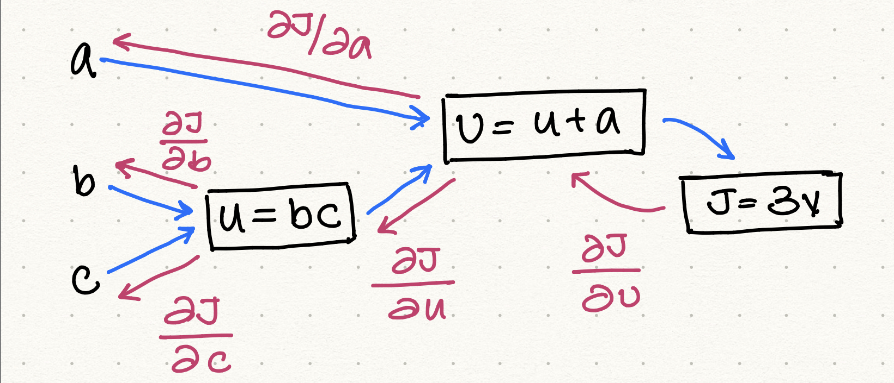

So, we can see how we can reach back from $J$ all the way to a, we need to compute $\partial J/\partial a$ and so forth. 

So, if we started with $a = 5, b = 3, c=2$, we end up with $da = 3, db = 6, dc=9$ through backpropogation. 

### Logistic Regression Gradient Descent (1 Training Example)

To compute the gradient descent for logistic regression, we first setup the equations we have: 
$$
z = w^Tx + b \\[10pt]
\hat{y} = a = \sigma(z) \\[10pt]
\mathcal{L}(\hat{y},y) = -(ylog\hat{y} + (1-y)log(1-\hat{y})
$$
The above are the set of equations for 1 sample. Let's create a computation graph for two features, 

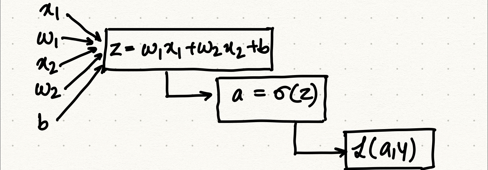

In this case, the model has three parameters, $w_1, w_2, b$. Through backpropogation, we wish to modify the features weights such that the loss function $\mathcal{L}(a, y)$ is minimized. So, we have the following relationships for the feature weights: 
$$
dw_1 = \frac{\partial \mathcal{L}}{\partial w_1} = \frac{\partial \mathcal{L}}{\partial a}\frac{\partial a}{\partial z}\frac{\partial z}{\partial w_1} \\[15pt]

dw_2 = \frac{\partial \mathcal{L}}{\partial w_2} = \frac{\partial \mathcal{L}}{\partial a}\frac{\partial a}{\partial z}\frac{\partial z}{\partial w_2} \\[15pt]

db = \frac{\partial \mathcal{L}}{\partial b} = \frac{\partial \mathcal{L}}{\partial a}\frac{\partial a}{\partial z}\frac{\partial z}{\partial b} \\[15pt]

dz = \frac{\partial \mathcal{L}}{\partial z} = \frac{\partial \mathcal{L}}{\partial a}\frac{\partial \mathcal{a}}{\partial z}
$$
These are the main equations that connect the loss function, $\mathcal{L}(a, y)$ with the weights, $w_i$, $w_2$ and the intercept, $b$.  

So, let's compute the derivative of the loss function with respect to these parameters: 

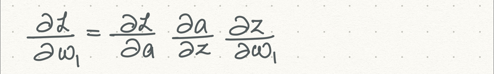

This involves computing each of the separate derivatives. Let's work these out separately: 

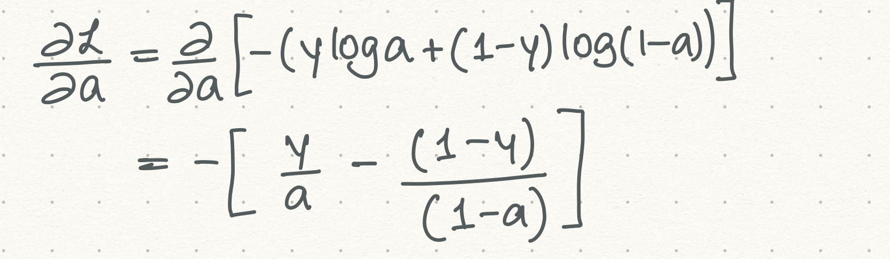

Now the second derivative in the chain rule: 

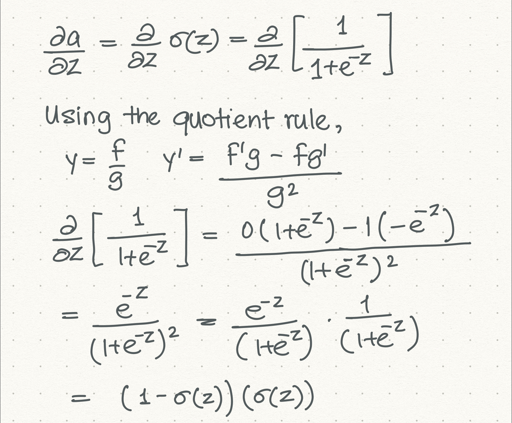

Finally, the last derivative in the chain: 

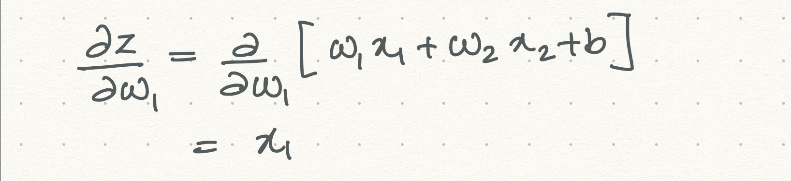

Which then comes out to be the product of individual results. We can for now write this as a shorthand notation: 
$$
\frac{\partial \mathcal{L}}{\partial w_1} = dw_1 = \frac{\partial \mathcal{L}}{\partial z}\frac{\partial z}{\partial w_1} = x_1dz
$$
Similarly, we have: 
$$
\frac{\partial \mathcal{L}}{\partial w_2} = dw_2 = \frac{\partial \mathcal{L}}{\partial z}\frac{\partial z}{\partial w_2} = x_2dz \\[15pt]
\frac{\partial \mathcal{L}}{\partial b} = db = \frac{\partial \mathcal{L}}{\partial z}\frac{\partial z}{\partial b} = 1dz
$$
We can of course compute $dz$ as, 


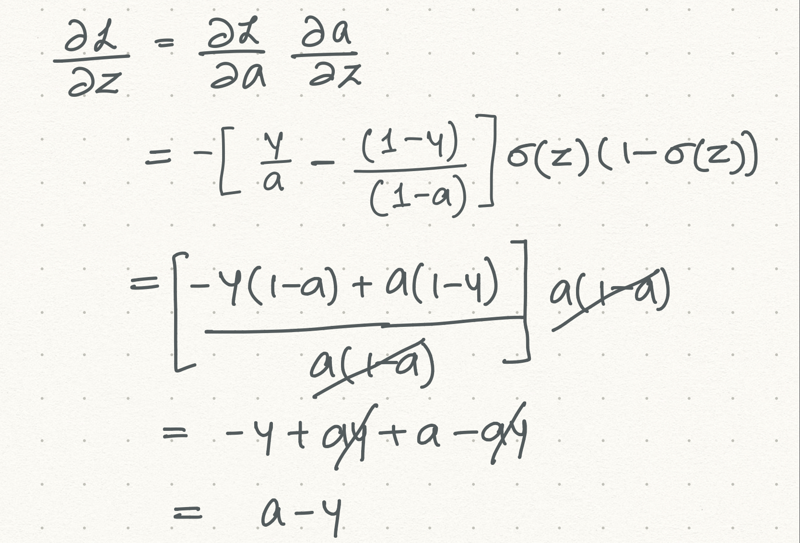

And therefore, the updates will be: 
$$
dz = a - y \\[15pt]
w_{1updated} = w_1 - \alpha \left(\frac{\partial \mathcal{L}}{\partial w_1}\right)= w_1 -\alpha(x_1dz) = w_1 - \alpha x_1(a-y)\\[15pt] 
w_{2updated} =  w_2 - \alpha \left(\frac{\partial \mathcal{L}}{\partial w_2}\right) = w_2 -\alpha(x_2dz) = w_2 - \alpha w_2(a-y)\\[15pt]
b_{updated} = b -\alpha(dz) = b - \alpha (a-y)\\[15pt]
$$

We now see the use of backpropogation. The backpropogation is used to change the feature weights in order to reduce the cost function. 

### Logistic Regression Gradient Descent ($m$ Training Example)

Logistic regression example we did above was used for one training example. In this section, we expand this to include $m$ training examples. Note that we still have two features $x_1, x_2$ and associated weights, $w_1, w_2$ and the bias, $b$. 

The code for setting this for $m$ examples. Here the example assumes two features and associated two weights.  

```python
def sigma(z):
    result = 1/(1+math.exp(z))
    return result

J = 0
dw1 = 0
dw2 = 0
db = 0


# We go through each training example: 
for i in range(len(m)):
    z[i] = w[i] * x[i] + b
    a[i] = sigma(z[i])
    J += -(y[i] * math.log(a[i]) + (1-y[i]) * log(1-a[i]))
    
    # Now the updates: 
    dz[i] = a[i] - y[i]
    dw1 += x[i] * dz[i]
    dw2 += x[i] * dz[i]
    db += dz[i]

# Finally divide everything by m
J = J/m
dw1 = dw1 / m
dw2 = dw2 / m
db = db / m

# Now we update the weights: 
w1 = w1 - alpha * dw1
w2 = w2 - alpha * dw2
b = b - alpha * db
```

All of this is done for one pass of the gradient descent. So, we have to encase this code from line 11 to the end in another for loop to run the gradient descent through multiple epochs. 

 If we have $n$ features, we will need to write a loop that will update all the weights in a single pass. As you can see there are far too many nested loops to do this quickly. That is where **vectorization** becomes incredibly important. Vectorization allows us to do the same calculations without the need for for loop. 

### Vectorization

Vectorization of code allows us to do computation much faster. This is especially important when we have a lot of data. The vectorization we have seen in the logisitic regression is the computation of the dot product, $z = w^Tx + b$. There are two ways to compute the dot product: using the `for` loop and through vectorization by implementing the `numpy` arrays. 


```python
# Non-vectorized form:
z = 0
for i in range(n):
    z += w[i] * X[i]
z += b
```

This would be really slow. In python the above operation is performed as follows, 

```python
z = np.dot(w, X) + b
```

Let's see this in action: 

```python
import numpy as np
import time

a = np.random.randn(1000000)
b = np.random.randn(1000000)

def non_vectorized():
    start = time.time()
    z = 0
    for i in range(len(a)):
        z += a[i] * b[i]
    end = time.time()
    return end - start

def vectorized():
    start = time.time()
    z = np.dot(a, b)
    end = time.time()
    return end - start

if __name__ == '__main__':
    nv = []
    v = []
    for i in range(100):
        nv.append(non_vectorized())
        v.append(vectorized())
    print("Average Non-vectorized: ", np.mean(nv))
    print("Average Vectorized: ", np.mean(v))
```

And here is the response: 

```python
Average Non-vectorized:  506.9623470306397
Average Vectorized:  6.353855133056641
```

The total time taken is in milliseconds. We see that the vectorized form is nearly 100 times faster than the non-vectorized version. 

Therefore, it is important to vectorize your code when working with deep learning. Another advantage of vectorization is that the good can be parallelized and will run much faster when working with GPUs. The CPUs can also do this, GPUs are designed to make the calculations parallel. 

>   When possible avoid explicit for loops

Let's look at another example. Suppose, you have the following product: 
$$
u = exp(v)
$$
Here, $v$ is a n-dimensional vector. So, in order to carry out this operation, we will need to use a for loop and store the information in an array. It would be something like this: 

```python
# Non-vectorized form
u = []
for i in range(len(v)):
    u.append(math.exp(v[i]))
  
# Vectorized form:
u = np.exp(v)
```

### Vectorizing Logistic Regression

Having solved one part of the problem to remove a for loop, we attempt to remove the second for loop that runs through all of the $m$ examples. 

Now, note that in the equation, 
$$
z^{(i)} = w^Tx^{(i)} + b
$$
we compute the $z$ for each sample. This is what we have for the first row after the for loop in the above figure. Here, $x^{(i)}$ is a feature vector for the $i$th sample. The weight $w$ is also a vector with elements equal to that of the dimensions of $x^{(i)}$. But rather than multiplying each row of features of a given sample, we can put all the features and all samples into a matrix. Something like this, 

 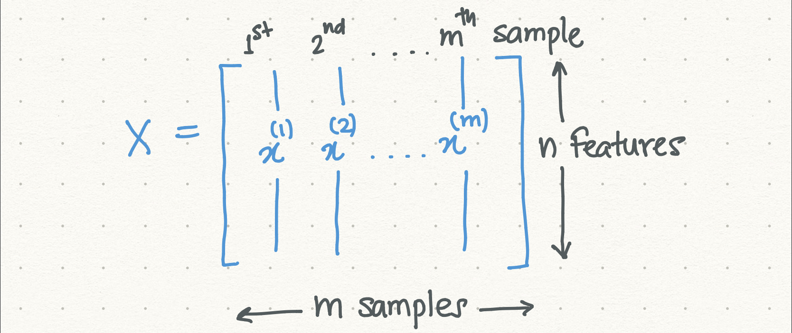

So, we have $m$ samples or observations. There are a total of $n_x$ features. The row that is shown corresponds to a given feature across all the $m$ samples. The above equation can then be written as, 
$$
Z = W^TX + B
$$
where $X$ is a matrix $X \in \R^{n_x \times m}$, $W$ is a column vector, $W \in \R^{n_x \times 1}$ and $B$ is a column vector, $B \in \R^{1 \times 1}$.  Equation 18 then corresponds to a matrix multiplication with a vector and addition with a scalar. 

So, we go from, 

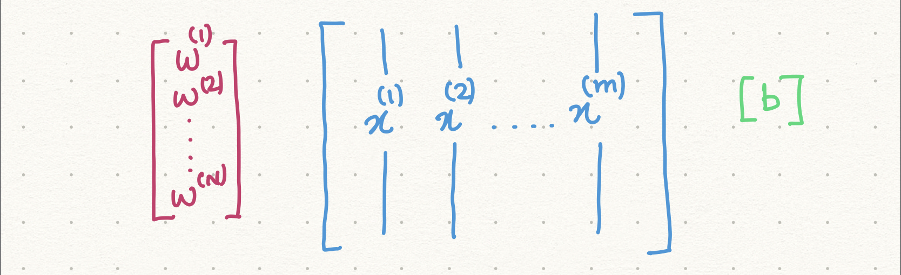

To this, which is taking a transpose of $w$: 

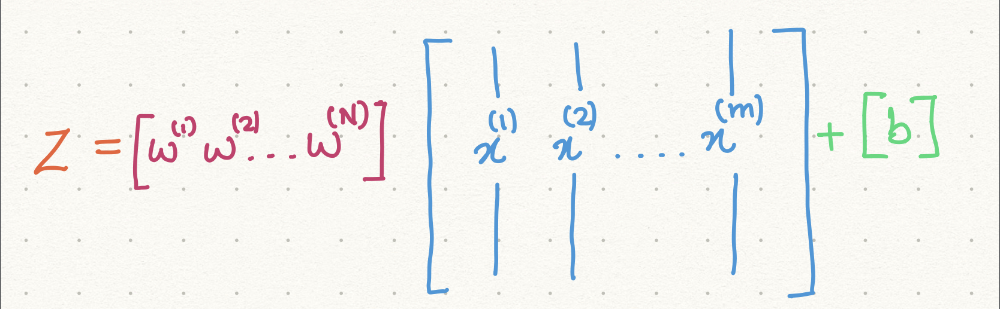

Note that $b$ is a single element but through **broadcasting** in Python, it is made into a row vector with dimensions equal to the $n_x$. Let's check the dimensions, 

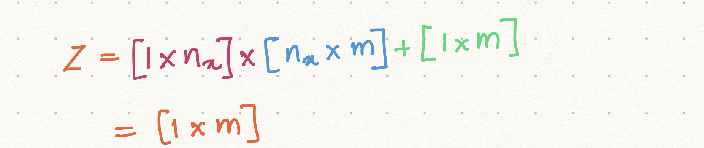

We would then write the equation 18 in python as: 

```python
z = np.dot(W.T, X) + b
```

That's it. This gives us all the $z$ values across all the samples. Similarly, the prediction, $a$ can be computed as: 

```python
a = 1/(1 + np.exp(-z))
```

This will result in $1 \times m$ dimension vector, which is what we expect. 

Next, let's see how we can vectorize the backpropogation. 

The first one is $dz$. This is very easy to do as we already have $a$ and $y$ and row vectors. We simply subtract one from each other to get a row vector. 

```python
dz = a - y
```

Next are the updates to $b$ and $w$: 

In the case of $db$, we have effectively, $db = 1/m \sum_{i=1}^m dz^{(i)}$, which we can write as: 

```python
db = (np.sum(dz))/m
```

For the updates to weights, we have: $dw = (1/m) X \cdot dz^T$. which we can write as, 

```python
dw = (np.dot(X, dz^T))/m
```

With that we can write the python code as follows, 

```python
J = 0, dw = np.zeros(n,1)

# Forward Propogation: 
Z = np.dot(w.T, X) + b
A = 1/(1 + np.exp(Z))

# Back Propogation: 
dz = A - Y
dw = 1/m(np.dot(X, dz.T))
db = 1/m(np.sum(dz))

# Gradient Descent update
w = w - alpha * dw
b = b - alpha * db
```

We have gotten rid of the for loops but for going through multiple iterations of gradient descent, we will need to implement a for loop. 

### Broadcasting in Python

Suppose we have the following table of food and associated macronutrients in 100g of the food: 

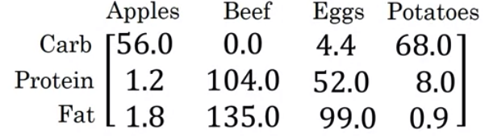

Rather than computing the grams of each macronutrient, we wish to compute their percentage of total weight. We can easily do this using vectorization as follows: 

```python
import numpy as np

# Set up the matrix: 
 calories = np.matrix([[56, 1.2, 1.8],
                       [0.0, 104, 135],
                       [4.4, 52, 99],
                       [68, 8, 0.9]])
# Each of the array is actually a row, so we take a transpose of it:
calories = calories.T
print(calories)
```

The output looks something like this: 

```python
matrix([[ 56. ,   0. ,   4.4,  68. ],
        [  1.2, 104. ,  52. ,   8. ],
        [  1.8, 135. ,  99. ,   0.9]])
```

Next we take the sum of each of the columns: 

```python
sum_val = np.sum(calories, axis=0)
```

When `axis=1`, we would take sum of the rows rather than the columns. 

Finally, we divide the `sum_val` with the matrix: 

```python
result = 100 * np.round(calories / sum_val.reshape(1, 4),2)
print(result)
```

```python
array([[95.,  0.,  3., 88.],
       [ 2., 44., 33., 10.],
       [ 3., 56., 64.,  1.]])
```

Note that when we divided the `sum_val` with a matrix, we **cast** it as a 1 by 4 matrix. This is not required as `sum_val` is already in the correct dimension. However, if one is unsure, it is important to use the `.reshape()` method. 

So, one thing is clear. How did we divide a $3 \times 4$ matrix with a $1 \times 4$ matrix? This is where the **broadcasting** comes into picture. Through broadcasting, Python took the $1 \times 4$ matrix and converted it to a $3 \times 4$ matrix, thus making the calculation possible. It did so by repeating the row, two times. 

>   *   If you have a matrix with dimensions, $(m, n)$ and do any mathematical operation with a $(1, n)$ matrix or with $(m, 1)$ matrix, you will get a $(m, n)$ matrix
>   *   If you have a matrix with dimension $(m, 1)$ (or a $(1, m)$) and do a mathematical operation with a scalar, you will end with a $(m, 1)$ or $(1, m)$ matrix. 

### Numpy Vectors

Broadcasting can be confusing at times. So, let's see how we can avoid this confusion. 

Consider the following example: 

```python
import numpy as np

a = np.random.randn(5)
```

This creates a vector with 5 randomly generated values: 

```python
array([-1.02353477, -0.0083769 ,  0.4808782 , -2.23798533,  0.85900304])
```

If you look at the shape of this vector, you will find: 

```python
a.shape
(5,)
```

This is neither a column or a row. So, doing a transpose will have no effect on this vector. So, it is important not to use such a data structure. Instead, use the following: 

```python
b = np.random.randn(5, 1)
```

This gives us a column vector. The shape agrees with what we created: 

```python
b.shape

(5, 1)
```

And this is how it looks: 

```python
array([[-0.15191493],
       [ 1.08354514],
       [ 0.21466363],
       [ 1.32826618],
       [ 0.57910842]])
```

Doing a transpose now works: 

```python
b.T
array([[-0.15191493,  1.08354514,  0.21466363,  1.32826618,  0.57910842]])
```

In short, make sure to explicitly state the right dimension of a vector. In other words, commit to creating a row or a column vector explicitly. 

You can also use `.reshape()` to convert a vector into a form you want. 

### Python Basics with Numpy Lab

#### Sigmoid Function

Let's build the sigmoid function

```python
# Basic function

def basic_sigmoid(x):
    s = 1/(1 + math.exp(-x))
    return s
```

We hardly use `math` package in deep learning because the the above function expects a single value. When working in deep learning, often we pass an array. Passing an array in the above function results in type error. 

Let's implement a sigmoid function using Numpy

```python
# Function using Numpy

def sigmoid(x):
    s = 1/(1 + np.exp(-x))
    return s
```

This function can take an array. For example, 

```python
x = np.array([1, 2, 3])
sigmoid(x)

array([ 0.73105858,  0.88079708,  0.95257413])
```

#### Gradient of Sigmoid

The gradient of the sigmoid is given by, 
$$
\sigma^{'}(x) = \sigma(x)(1 - \sigma(x))
$$

```python
# Gradient of Sigmoid Function

def sigmoid_derivative(x):
    """
    Compute the gradient (also called the slope or derivative) of the sigmoid
    function with respect to its input x.
    You can store the output of the sigmoid function into variables and then use
    it to calculate the gradient.
    
    Arguments:
    x -- A scalar or numpy array

    Return:
    ds -- Your computed gradient.
    """
    s = sigmoid(x)
    ds = s*(1-s)
    return ds
    
```

#### Reshaping Arrays

Two common numpy functions used in deep learning are:

*    `np.shape` used to get the shape of an array 
*   `np.reshape()` used to reshape an array into some other dimensions

Implement `image2vector()` that takes an input of shape (l, h, 3) and returns a vector of shape (l\*h\*3, 1). 

```python
def image2vector(image):
    """
    Argument:
    image -- a numpy array of shape (length, height, depth)
    
    Returns:
    v -- a vector of shape (length*height*depth, 1)
    """
    length = image.shape[0]
    height = image.shape[1]
    depth = image.shape[2]
    v = image.reshape(length * height * depth, 1)
    return v
```

#### Normalizing Rows

Normalization of vectors is performed by dividing the components of the vector by its norm. So, given a matrix, 

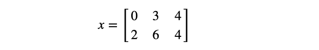

The normalized matrix will have the following form: 

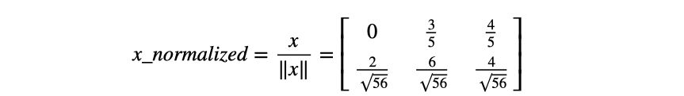

Where each element in the above matrix was divided by the norm, $||x|| = 5/\sqrt{56}$. 

Let's implement `normalizeRows()` function to normalize the rows of a matrix. 

```python
def normalizeRows(x):
    """
    Implement a function that normalizes each row of the matrix x (to have unit
    length).
    
    Argument:
    x -- A numpy matrix of shape (n, m)
    
    Returns:
    x -- The normalized (by row) numpy matrix. You are allowed to modify x.
    """
    x_norm = np.linalg.norm(x, axis=1, keepdims=True)
    x_normalized = x / x_norm
    return x_normalized
```

#### Softmax Function

Implement a softmax function using numpy. You can think of softmax as a normalizing function used when your algorithm needs to classify two or more classes. You will learn more about softmax in the second course of this specialization.

**Instructions**:

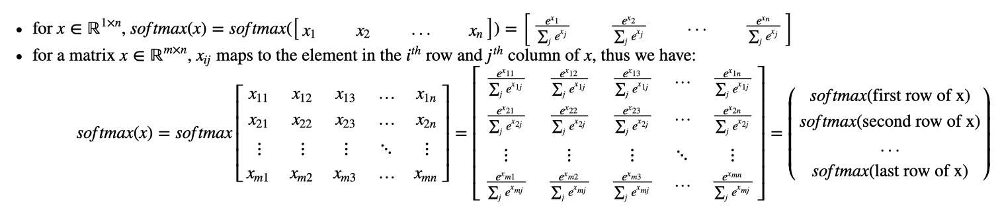

```python
def softmax(x):
    """Calculates the softmax for each row of the input x.

    Your code should work for a row vector and also for matrices of shape (m,n).

    Argument:
    x -- A numpy matrix of shape (m,n)

    Returns:
    s -- A numpy matrix equal to the softmax of x, of shape (m,n)
    """
    
    x_exp = np.exp(x)

    # Create a vector x_sum that sums each row of x_exp. 
    # Use np.sum(..., axis = 1, keepdims = True).
    x_sum = np.sum(x_exp, axis=1, keepdims=True)
    
    # Compute softmax(x) by dividing x_exp by x_sum. It should automatically 
    # use numpy broadcasting.
    s = x_exp/x_sum

    ### END CODE HERE ###
    
    return s
```

**What you need to remember:**

*   `np.exp(x)` works for any `np.array(x)` and applies the exponential function to every coordinate
*   the sigmoid function and its `gradientimage2vector()` is commonly used in deep learning
*   `np.reshape` is widely used. In the future, you'll see that keeping your matrix/vector dimensions straight will go toward eliminating a lot of bugs. 
*   numpy has efficient built-in functions
*   broadcasting is extremely useful

#### Implement L1 and L2 loss functions

Let's implement regularization functions using lumpy: 

```python
def L1(yhat, y):
    """
    Arguments:
    yhat -- vector of size m (predicted labels)
    y -- vector of size m (true labels)
    
    Returns:
    loss -- the value of the L1 loss function defined above
    """
    loss = np.sum(np.abs(y-yhat))
    
    return loss
```

So, if we are given, 

```python
yhat = np.array([.9, 0.2, 0.1, .4, .9])
y = np.array([1, 0, 0, 1, 1])
print("L1 = " + str(L1(yhat,y)))

1.1
```

Let's implement L2 norm: 

```python
def L2(yhat, y):
    """
    Arguments:
    yhat -- vector of size m (predicted labels)
    y -- vector of size m (true labels)
    
    Returns:
    loss -- the value of the L2 loss function defined above
    """
    loss = np.sum((y - yhat)**2)
    
    return loss
```


### Quiz: Week 2

1.  What does a neuron compute in logistic regression? 

2.  What is the logistic regression loss function? 

3.  Give me an example of `.reshape()` where we have 4 elements in a column

4.  Given the following: 

    ```python
    a = np.random.randn(2, 3) # a.shape = (2, 3)
    b = np.random.randn(2, 1) # b.shape = (2, 1)
    c = a + b
    ```

    What are the dimensions of c? 

5.  Given the following: 

    ```python
    a = np.random.randn(4, 3) # a.shape = (4, 3)
    b = np.random.randn(3, 2) # b.shape = (3, 2)
    c = a*b
    ```

    What are the dimensions of c? 

6.  Suppose you have $n_x$ input features per example. Recall that $X = [x^{(1)} x^{(2)} ... x^{(m)}]$ What is the dimension of X?

7.  Suppose img is a (32,32,3) array, representing a 32x32 image with 3 color channels red, green and blue. How do you reshape this into a column vector?


### Answers

1.  The neuron computes the linear function followed by the activation function
2.  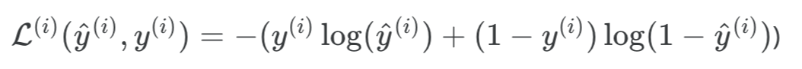
3.  `a.reshape(1,4)`
4.  `c.shape(2,3)`
5.  `Not Possible`
6.  $(n_x, m)$
7.  (32 x 32 x 3, 1)

