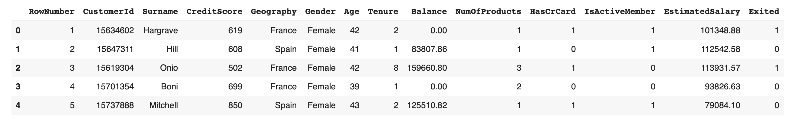
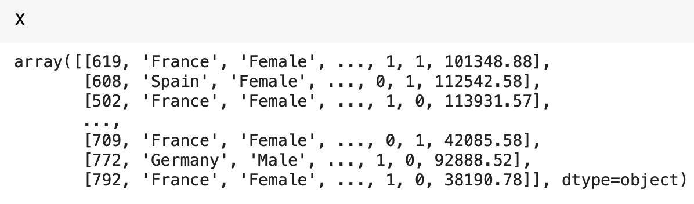
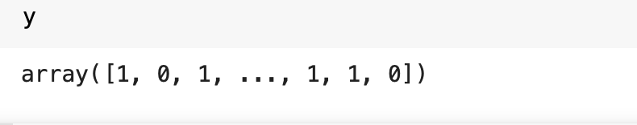
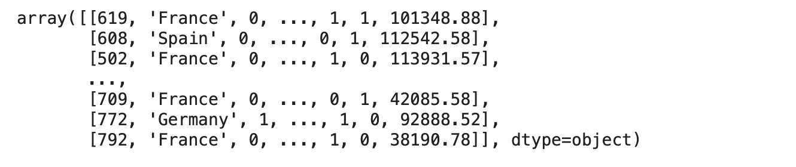
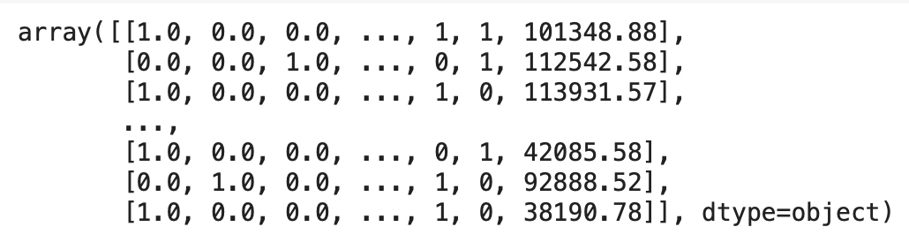
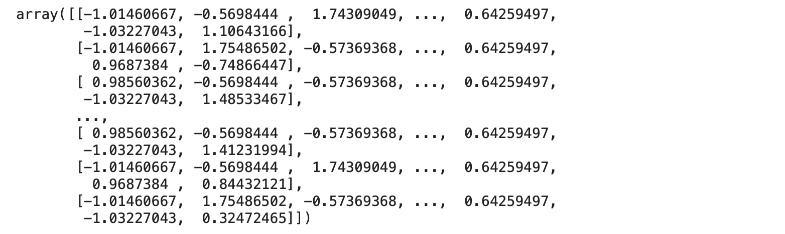
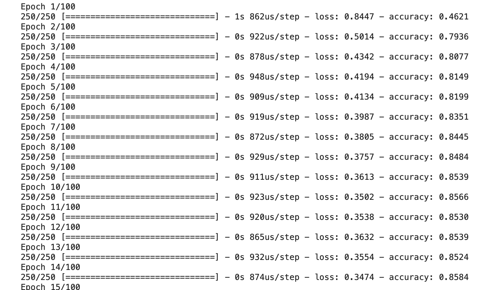

[TOC]


# Artificial Neural Network

In this part we will learn: 

1.  [The intuition of ANNs](## ANN Intuition)
2.  How to Build an ANN
3.  How to predict an outcome of a single observation

For more in-depth material, check out [The Ultimate Guide to Artificial Neural Netowrk (ANN)](https://www.superdatascience.com/blogs/the-ultimate-guide-to-artificial-neural-networks-ann)

## ANN Intuition

In this section, we will begin into the depth of ANN. Here are few things we will cover in this section: 

*   [The Neuron](# The-Neuron)
*   [The Activation Function](#The-Activation-Function)
*   How do Neural Networks Work?
*   How do Neural Networks Learn?
*   Gradient Descent
*   Stochastic Gradient Descent
*   Backpropogation

### The Neuron

In the previous chapter we covered what a neuron. In this section we will see how we can recreate this in a computer. A neuron consists of a nucleus and have multiple branches coming out of it. They look something like this: 


Neurons by themselves are quite useless. They cannot do anything by themselves. However, when they are connected with other neurons, they can do a lot. The **dendrites** are the receivers of the neurons while the **axon** are the transmitters. An electric signal passes between neurons and that is how they communicates with each other. 

### Neurons in Machines

We create the neuron conceptually as follows: 


Here we have the input layer, which is indicated by the yellow neurons. This is not the case in a neuron in the brain but we make use of **input neurons** that take information from input values and passing to the neuron. Such a neuron is presented by the color green. The neuron then processes these signals and passes to the output layer. The output layer is presented by a red. 

Let's look at in more detail: 

*   **Input layer** - Are independent variables. Each neuron in yellow is a single independent variable. If there are $m$ features, we will have $m$ neurons in the input layer. **The independent variables need to be standardized and scaled**. To know more about why need to standardized and scale, read this [article](http://yann.lecun.com/exdb/publis/pdf/lecun-98b.pdf).
*   **Output Layer** - The output layer can be numerical, binary, or categorical variable with multiple categories. 

It is important to remember that at any given point, the ANN will take a single observation, process it and output the prediction of that single observation. 


Each of the connection between neurons have associated **weights**. The learning of Neural Network is learning what weights each synapse should be in order for the prediction to be as close to actual observation. 

The **neuron** takes the weighted sum of all the input values from the input feature. We then assign an **activation function** to the weighted sum of the observations. The result of the activation is then passed to the output. 

So, we can think of the whole process in four steps: 

1.  The input layer passes the features to the neurons. Each input has an associated weight. The feature and the weights are passed to the neuron. 
2.  The neuron takes a weighted sum of the input layer.
3.  The neuron passes this weighted sum through an activation function
4.  The output of the activation function is passed to the output layer


### The Activation Function

There are four differnet types of activation functions that exists. 

*   **Threshold Function**. It is a very simple function which is zero for some values and then is equal to 1 for the rest of the values. This is sort of a binary function

    

    

*   **Sigmoid Function** The sigmoid function is used in logisitic regression. It is a smooth function that gradually increases from 0 to 1, unlike the threshold function. This is often used to prediction 

    

    

*   **Rectifier Function**: This is one of the most used in the ANN.

    

    

*   **Hyperbolic Tangent**: This is another smooth function that looks like the sigmoid function. 

    

The activation function is applied in the hidden layer but depending on the type of an output, we will also apply another activation at the output layer such that the output is as expected. The common practice is to apply the rectifier in the hidden layers and the sigmoid for the output layer if the expected output is binary or categorical. 


### How do Neural Networks Work?

To explain how a neural network works we will use a tutorial to predict property prices. One caveat is that we assume that the neural network is already trained. Here we want to see what a trained neural network does. 

In terms of property we have the following features: 

*   Area
*   Bedrooms
*   Distance to city
*   Age

These features will be our input neurons. This would look something like this: 


We can get the price based on a linear combination of features and weights. This is similar to what we have in linear regression. So, how is neural network different from standard multiple linear regression? 

The power of neural network comes from the use of hidden layer. The hidden layer or layers gives power to the neural networks. So, in our example, we add a hidden layer. Now let's consider the first neuron in the hidden layer: 


We pass all the features to this neuron and associated non-zero weights. Let's say this this neuron gives more weightage to Area and Distance to city and less to the other. This could be because this neuron thinks that going away from the city center will result in decrease in the price for a given area. So, this neuron may pick such a condition. We don't know but it is something the neuron has picked through learning. Remember, we have already taught this neural network with training data. 

We pass all the features to each of the neurons in the hidden layer. Just as the first neuron, we find that each neurons give different weights to each of the input features. This is the power that the neural network has, the combination of the features. The neural network will pick up combinations of features that we would not have thought of. The final neural network would look something like this: 

 

These synapses shown here are the synapses that have non-zero weights. Finally, all the neurons in the hidden layer send their output to the output layer, where the final predictionis made. 

This is in short how a neural network works. 

### How do Neural Networks Learn?

The neural network is given a large amount of data. For example, in order to train a neural network to distinguish between a cat and a dog, it is given thousands of images of cat and dog. We then ask it to go and learn from these images. The neural network finds features that allows it to distinguish and be trained. 

A single-layered neural network that we have seen so far is called a **perceptron**. Such a perceptron looks like this: 


The perceptron learns in the following way: 

1.  The perceptron takes features from a single instance. It goes, along with associated weights, to the neuron.
2.  The activation function is applied to the weighted sum of the features
3.  The resultant information is then sent to the output layer. 
4.  The output layer compares the prediction $\hat{y}$ with the actual value $y$. 
5.  How close the prediction is to the actual value is determined by the loss function. The typical loss function is $L = 1/2(\hat{y} - y)^2$
6.  We repeat steps 1 - 5 for each of the observations in the dataset while keeping track of each prediction. 
7.  We compute the cost function, which is the sum of loss functions.
8.  We adjust the weights of the perceptron
9.  We repeat steps 1-8 until the cost function has been minimized. 

We can see these steps visually as follows. Suppose we have a dataset that has 8 rows. It would look something like this: 


We have the neural network on the left. It is the same neural network but shown 8 times corresponding to the 8 observations in the dataset. Now as we go through each observation, we compute the predictions for each observation. We now have 8 predictions corresponding to the 8 observations: 


We can now compute the **cost function**, which is a sum of **loss function**, for the dataset. 

Once we have the cost function, we adjust the weights of the percepton. And with these new weights, we again go through all the observations. We compute the cost function again, change the weights and repeat. We stop when we have have minimized the cost function. The method used to update the weights is called **backpropogation**. 

>   Going through all of the observations in the dataset is called an epoch. To train a neural network, we run through multiple epochs. 

You can learn from about the cost functions [here](https://stats.stackexchange.com/questions/154879/a-list-of-cost-functions-used-in-neural-networks-alongside-applications)

### Gradient Descent

As we saw in the previous section, the backpropogation along with the cost function updates the weights. However, the right weights that reduce the cost function to the minimum is often one in the total number of combinations. Finding this value is often not possible due to the curse of dimensionality. That is where the gradient descent comes in. 

The gradient descent is an iterative algorithm that finds the minimum of the cost function by computing the gradient of the cost function at a given point. Gradient descent works well when the function is smooth and really well when the cost function has just one minima. 

So rather than looking at each combination of weights, we simply look at weights that decrease the cost function. 

### Stochastic Gradient Descent

There are two reasons why the gradient descent by itself is not good: 

1.  The gradient descent uses all of the observations to find the gradient of the cost function
2.  It is sensitive to a local minima and therefore it requires the cost function to be convex. 

Stochastic gradient descent addresses both of these issues by computing the gradient of the cost function by using just a single observation. The weights are adjusted by using a single observations rather than adjusting them after going through all the observations. The gradient descent is also known as **batch gradient descent**. 

Here's how the weights are updated in either of the methods: 


Stochastic gradient descent is also faster as it uses less data. 

There is a nice article on [Gradient Descent](https://iamtrask.github.io/2015/07/27/python-network-part2/) that you can read. 

### Backpropagation

So far we have see that we move forward and backward through the network. This movement through the network does the following: 

*   **Forward Propogation**: This is done starting from the input layer, moving through the hidden layers and get to the output layer with a prediction. We calculate the errors. 
*   **Backpropagation**: This is done by moving from the output layer, through the hidden layers to the input layers. This process involves updating weights

We can see this graphically as follows:


The backpropagation updates all the weights at the same time rather than updating each individual weight. 

#### Training a Neural Network

Let's go through the steps taken to train a neural network: 

1.  Randomly initialize the weights to a small numbers, close to 0 but not exactly 0
2.  Input the first observation of your dataset in the input layer each feature in one input node. 
3.  Forward propogate and predict the result, $\hat{y}$
4.  Compare the predicted result to the actual result. Measure the generated error
5.  Back-propogate and update the weights according to how much they are responsible for the error. The learning rate decides by how much we update the weights. 
6.  Repeat steps 1 - 5. Repeating can be done in two ways: 
    1.  Update the weights after each observation (Reinforcement Learning). 
    2.  Update the weights only after a batch of observations (Batch Learning)
7.  When the whole training set passed through ANN, that makes an epoch. Redo more epochs. 

## Building an Artificial Neural Network

In this section we will apply what we have learned so far to a business problem. We will use the data from the [following tables](https://drive.google.com/drive/folders/1qQtf6BbMd4yuIU1acBXqyZh1rNpR6GaK). 

We have the features about the customers from a bank. The output variable is the last column. It is a binary variable. Suppose the time period over which the data was received was 6 months. Based on this information, the bank wants to know whether a given customer is at risk of leaving the bank or not. 

We will do all the work in Google Colab.

```python
import pandas as pd
import numpy as np
import tensorflow as tf
```

The important library we will use is the TensorFlow Library. You can check the version of the tensflow using, `tf.__version__`

Now let's get the data: 

```python
path_to_file = "https://raw.githubusercontent.com/trillianx/deeplearning/main/deeplearning_a_z/Data/ANN/Python/Churn_Modelling.csv"

df = pd.read_csv(path_to_file)
df.head()
```



Now that we have the data, we can start with ML pipeline. 

### Part 1: Data Preprocessing

We start with the features and the target variable we need to include. 

```python
# Separate the features and the target variable
X = df.iloc[:, 3:-1].values
y = df.iloc[:, -1].values
```

We removed the first three columns because `RowNumber`, `CustomerId`, and `Surname` do not add any information. 

The `X` and `y` can be seen here: 





Next step is to encode the categorical data. There are two columns, `Gender` and `Geography`. We do it in the following way. 

```python
from sklearn.preprocessing import LabelEncoder
le = LabelEncoder()
X[:, 2] = le.fit_transform(X[:, 2])
```

We can print and see how it looks: 



We see that the gender is now gone and is replaced by a binary value. 

As there is no relationship between countries in the geography, we will use `OneHotEncoding`:

```python
from sklearn.compose import ColumnTransformer
from sklearn.preprocessing import OneHotEncoder
ct = ColumnTransformer(transformers=[('encoder', OneHotEncoder(), [1])], remainder='passthrough')
X = np.array(ct.fit_transform(X))
```

This results in the following table: 



We see that the one hot encoding has done encoding for the three countries we have in the data: 

```python
print(df.Geography.unique())

array(['France', 'Spain', 'Germany'], dtype=object)
```

Comparing the countries in the previous image, we can see that France is given (1, 0, 0) while Spain is given (0, 0, 1) and Germany (0, 1, 0). 

The next step would be to split the data into training and testing. 

```python
from sklearn.model_selection import train_test_split
X_train, X_test, y_train, y_test = train_test_split(X, y, test_size=0.2, random_state=0)
```

The net thing we will work on is feature scaling. This is very important to be done. 

```python
from sklearn.preprocessing import StandardScaler
sc = StandardScaler()
X_train = sc.fit_transform(X_train)
```

This is how the `X_train` looks like: 



### Part 2: Building Artificial Neural Network

The building part will be done in 4 steps. So, let's get to it. 

#### Initialize the Artificial Neural Network

We start by creating an instance of sequential class. 

```python
ann = tf.keras.models.Sequential()
```

#### Add the Input Layer and First Hidden Layer

To add a layer to an ANN, we make use of the `layers` module and the `Dense()` class. The `Dense()` class takes the argument as `units`. The `units` are the number of neurons that we need. 

There is no easy answer about the number of neurons we need. We start with a guess. Another would be to take the number equal to the number of features. But this is a hyperparameter, which we can tune to get better accuracy. 

```python
ann.add(tf.keras.layers.Dense(units=6, activation='relu'))
```

This creates the first hidden layer. 

#### Adding the Second Hidden Layer

Adding new layers is pretty easy as copying the same above code: 

```python
ann.add(tf.keras.layers.Dense(units=6, activation='relu'))
```

#### Adding the Output Layer

Adding an output layer is slightly different: 

```python
ann.add(tf.keras.layers.Dense(units=1, activation='sigmoid'))
```

Note that if we had an output that had 3 categories, we would then need 3 neurons. This is because when there are three categories, the `OneHotEncoding`, the output will be a combination of (1, 0, 0). 

Finally, we need `sigmoid` activation function that outputs a value between 0 and 1. So, we use the `sigmoid`. If you have more categories we use `softmax` instead of `sigmoid`

### Step 3: Training the Artificial Neural Network

To train the ANN, we will need to pick a loss function, the optimizer to find the minimum of the cost function, and the metric. 

```python
ann.compile(optimizer='adam', loss='binary_crossentropy', metrics=['accuracy'])
```

As we have seen in the theory, we use the optimizer the SGD. This is given by `adam`. For binary classification we use the loss function is `binary_crossentropy` when we have more categories, we use `category_crossentropy`. 

Now that we have compiled our model, we will train the model on our training. 

```python
ann.fit(X_train, y_train, batch_size=32, epochs=100)
```

The `batch_size` is a hyperparameter but as default we take it as `32`. 

The output looks something like this: 



We see that the accuracy for this model is about 86%. 

### Step 4: Making the Predictions and Evaluating the Model

Here's how we predict. However, note that in order to predict, we need to use of test observation in the same format as we had our original set. So, we need to do `OneHotEncoding` on categorical variables, `LabelEncoding` on gender and finally standard scaling on all of the data. 

```python
single_prediction = [[1, 0, 0, 600, 1, 40, 3, 60000, 2, 1, 1, 50000]]
sp_transform = sc.transform(single_prediction)
ann.predict(sp_transform)
```

This gives us, 

```python
array([[0.03608271]], dtype=float32)
```

So, we see that the predicted probability of the customer leaving is 3.6%. So, the person is unlikely to leave. 

We can get `True` or `False` if we use the following: 

```python
ann.predict(sp_transform) > 0.5 
```

This returns: 

```python
array([[False]])
```

### Step 5. Predicting the Test set Results

Now that we have done so with an example, let's make predictions with the test set to see how good the model has done. 

```python
X_test = sc.transform(X_test)
y_pred = ann.predict(X_test)
y_pred_bol = (y_pred > 0.5)
# Convert and reshape the vector
y_pred_final = (0 + y_pred_bol)
y_pred_final = y_pred_final.reshape(len(y_pred_final), 1)
y_test = y_test.reshape(len(y_test), 1)
```

To see how the model did, we will create a confusion matrix: 

```python
from sklearn.metrics import confusion_matrix, accuracy_score
cm = confusion_matrix(y_test, y_pred)
accuracy_score(y_test, y_pred)
```

