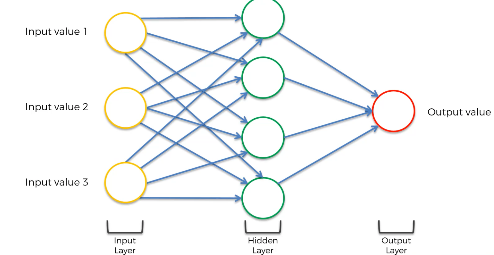
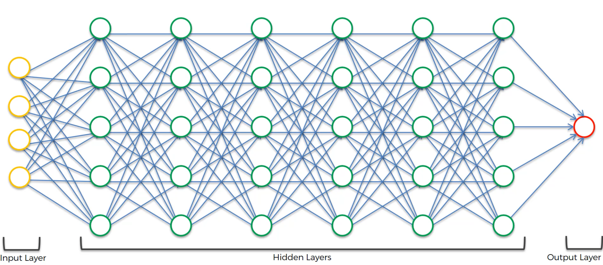

[TOC]

# Deep Learning A to Z: Hands-on Artificial Neural Network

## Introduction

Deep learning and neural network has been around for some time. These techniques were invented in 1960s but they died out over the next decade. This was because the technology was not there for deep learning. Deep learning requires a lot of data and processing power, something we did not have in 1960s. Deep learning is taking off right now because the technology has evolved to the extent that processing and storage is very cheap. 

This brings us to the question, "What is deep learning?"

## What is Deep Learning

Much of the work on Deep Learning comes from the works of Geoffery Hinton. The idea behind deep learning is to mimic the human brain and recreate using computer programs. The reason for doing this is because the brain is adaptive and works really well when it is given data. 

Deep learning makes use of **neurons** as we have in a brain. A neuron contains a body, which has a nucleus and branches coming out of it, which are synapse. Neurons connect themselves with each other through these synpases. A human brain contains billions of neurons. 

In a computer we create an artificial structure, which we call **neurons** or **nodes**. The artificial structure consists of the **input layer**. The input layer is where the structure receives its inputs. In our brain these are the senses. Here they are received from the input layer. The brain does not simply take the information and spits out. Instead, layers of neurons within the brain process this information which eventually results in an output. An output could be a decision or an action for example. 

Continuing with the same process, we have a **hidden layer**. The hidden layer processes all of the information from the input layer. The result of the processing is then sent to the **output layer**. The neuron with a single hidden layer looks something like this: 

 

This is called a deep learning when we include multiple hidden layer. This is something that looks like this: 

